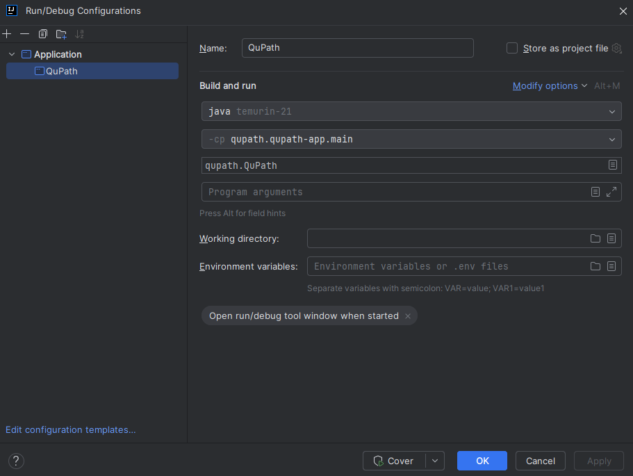

# NeuroR QuPath Extension

This repository contains a [QuPath](https://qupath.github.io) extension designed to simplify the deployment of [Neuro-R](https://www.neuro-cle.com/) within QuPath, enhancing image analysis workflows for pathology research.

## Installation

To install this extension, simply drag and drop the latest release into an open QuPath window, or place it in your QuPath extensions folder.

## Usage

1. Configure environment paths under Extensions > NeuroR Extension > Environments.
2. Set your preferences for segmentation, object detection, and classification in Extensions > NeuroR Extension > Segmentation/Object Detection/Classification.
3. Click the 'Generate' button next to Script Name to create a script, then edit the generated script name as needed.
4. Press the 'Create Script!' button to open the Script Editor with your custom script.
5. Start inference by pressing the 'Run' button at the bottom right of the Script Editor.

## Setting Up for Development

### Using IntelliJ IDEA

1. Clone this repository and open it in IntelliJ IDEA.
2. Clone QuPath's repository, then use "Link Gradle Project" to import the QuPath directory.
   
3. Add the line `includeFlat 'qupath-extension-neuror'` to `qupath/settings.gradle`.
4. Ensure that the value of `gradle.ext.qupathVersion` in `qupath/settings.gradle` is equal to the value specified by in `qupath-extension-neuror/settings.gradle`. 
5. Create a Run Configuration to launch QuPath.
   

With these steps, you should be able to see this extension automatically loaded into QuPath when running it in IntelliJ IDEA.

### Building JARs

1. Open the terminal in IDEA, then `cd` to the extension directory.
2. Run `./gradlew build`

Created JARs will be in `qupath-extension-neuror/build/libs/`.

### Troubleshooting

If you encounter `java.lang.ClassNotFoundException: org.slf4j.LoggerFactory` error while trying to run QuPath, try restarting IDEA.

# Acknowledgments

This work was supported by a grant from the Korea Health Technology R&D Project through the Korea Health Industry Development Institute (KHIDI), funded by the Ministry of Health & Welfare, Republic of Korea (grant number: HI21C1137).
